# Activité Pratique N°2 : Architecture Micro-services avec Spring Cloud

**Encadré par :** Pr. Mohamed YOUSSFI  
**Réalisé par :** Salma Majri

---

##  Objectif du Projet
L'objectif de cette activité pratique est de concevoir et déployer une application basée sur une **architecture micro-services** sous l'écosystème **Spring Cloud**. L'application permet de gérer des factures contenant des produits et associées à un client spécifique.

---

##  Stack Technique
* **Java / Spring Boot**
* **Spring Cloud Gateway** (Routage statique et dynamique)
* **Spring Cloud Netflix Eureka** (Service Discovery)
* **Spring Cloud Config Server** (Gestion centralisée de la configuration)
* **Spring Data JPA & Base de données H2**
* **OpenFeign** (Communication inter-services)

---

##  Architecture du Système
L'application se compose des micro-services suivants :
1. **Config Service** (`port: 9999`) : Service de configuration centralisée gérant les paramètres des micro-services.
2. **Eureka Discovery Server** (`port: 8761`) : Service d'enregistrement et de localisation des micro-services.
3. **Gateway Service** (`port: 8088`) : Point d'entrée unique gérant le routage vers les micro-services.
4. **Customer Service** (`port: 8081`) : Micro-service de gestion des clients.
5. **Inventory Service** (`port: 8082`) : Micro-service de gestion des produits.
6. **Billing Service** (`port: 8083`) : Micro-service de gestion des factures communiquant avec `Customer-Service` et `Inventory-Service` via **OpenFeign**.

---

##  Travail Réalisé & Captures d'écran

### 1. Création du micro-service `customer-service`
Développement du micro-service gérant l'entité `Customer` avec Spring Data REST.

* **Consultation d'un client (`http://localhost:8081/customers/2`) :**
  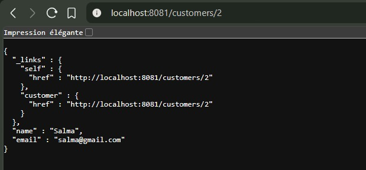

---

### 2. Création du micro-service `inventory-service`
Développement du micro-service de gestion des produits (`Product`).

* **Consultation d'un produit (`http://localhost:8082/products/1`) :**
  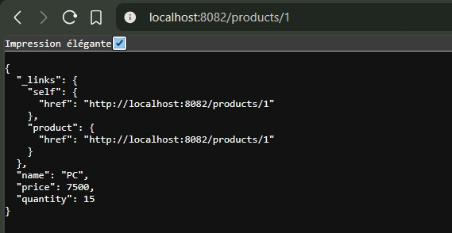

---

### 3. Service Discovery avec Eureka
Mise en place de l'annuaire de services Eureka Server (`port: 8761`) et enregistrement des micro-services.

* **Tableau de bord Eureka Server :**
  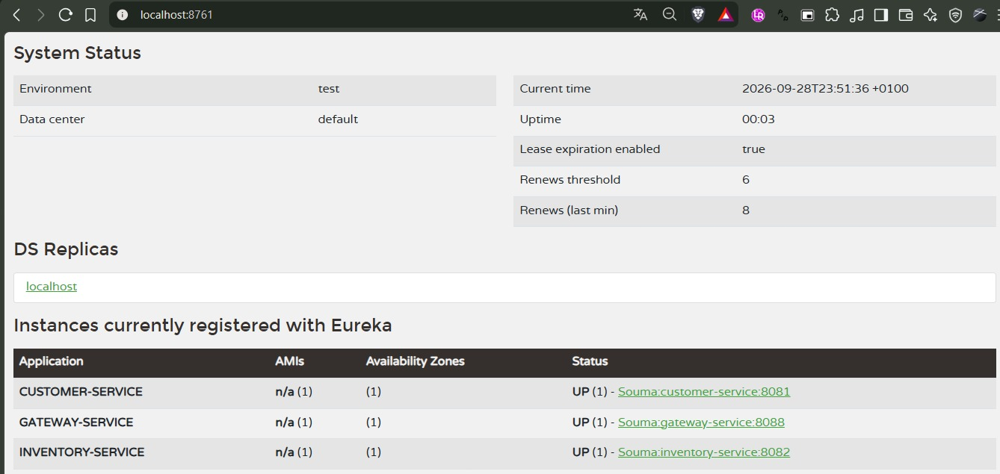

---

### 4. Configuration de Spring Cloud Gateway & Routage
Configuration de la Gateway pour le routage dynamique des requêtes vers les services enregistrés dans Eureka.

* **Accès à un client via la Gateway (`http://localhost:8088/CUSTOMER-SERVICE/customers/1`) :**
  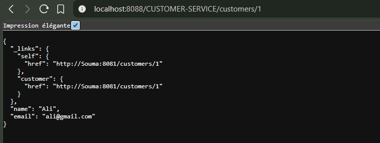

* **Accès à un produit via la Gateway (`http://localhost:8088/INVENTORY-SERVICE/products/1`) :**
  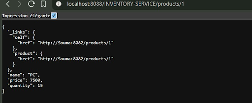

---

### 5. Création du service de facturation `billing-service`
Développement du service de gestion des factures (`Bill`) et de leurs éléments (`ProductItem`).

* **Consultation des factures (`http://localhost:8083/bills`) :**
  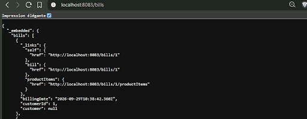

* **Consultation des articles de facture (`http://localhost:8083/bills/1/productItems`) :**
  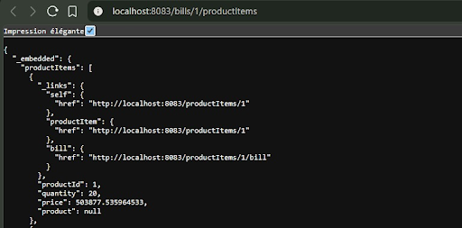

---

### 6. Communication inter-services avec OpenFeign
Utilisation d'**OpenFeign** par `billing-service` pour récupérer les données clients et produits depuis les micro-services respectifs.

* **Consultation d'une facture complète enrichie (`http://localhost:8083/api/bills/1`) :**
  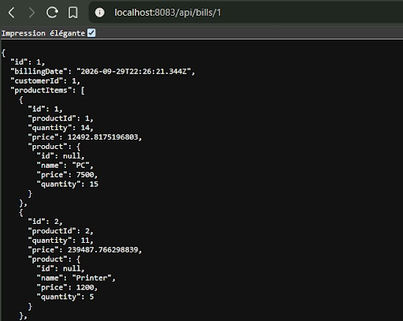

* **Accès à la facture via la Gateway (Partie 1) (`http://localhost:8088/BILLING-SERVICE/api/bills/1`) :**
  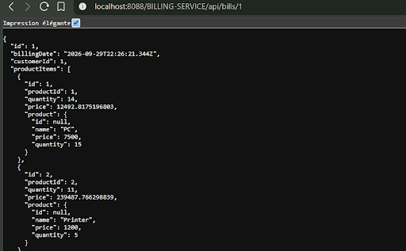

* **Accès à la facture via la Gateway (Partie 2 - Informations Client) :**
  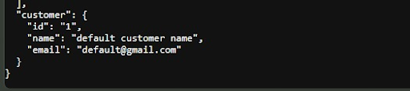

---

### 7. Configuration centralisée avec Config Server
Test de la récupération dynamique des paramètres de configuration depuis le service centralisé de configuration.

* **Test de la configuration dynamique (`http://localhost:8081/testConfig2`) :**
  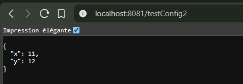